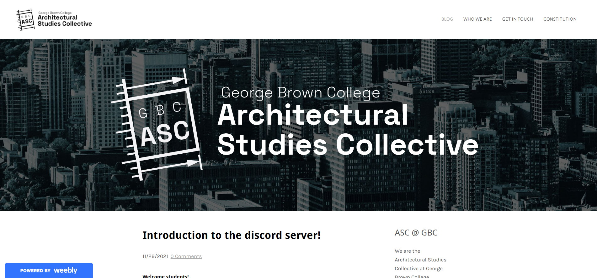
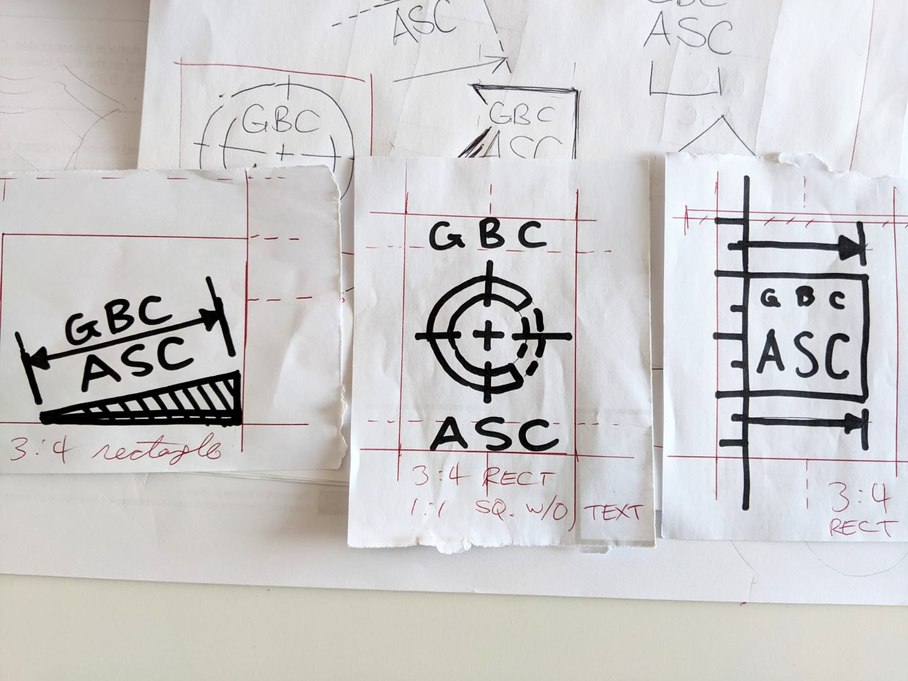
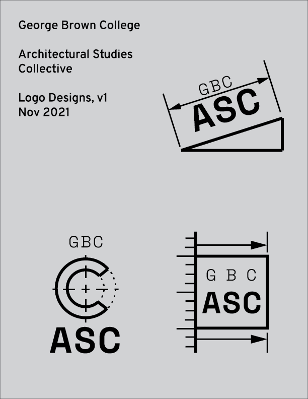
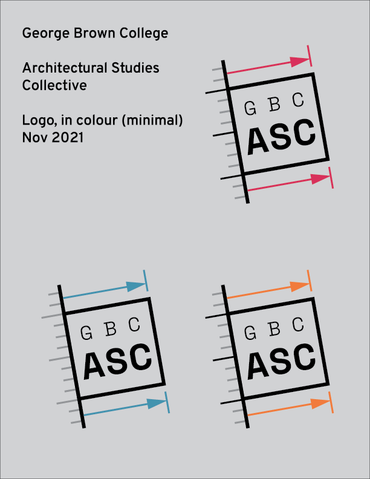
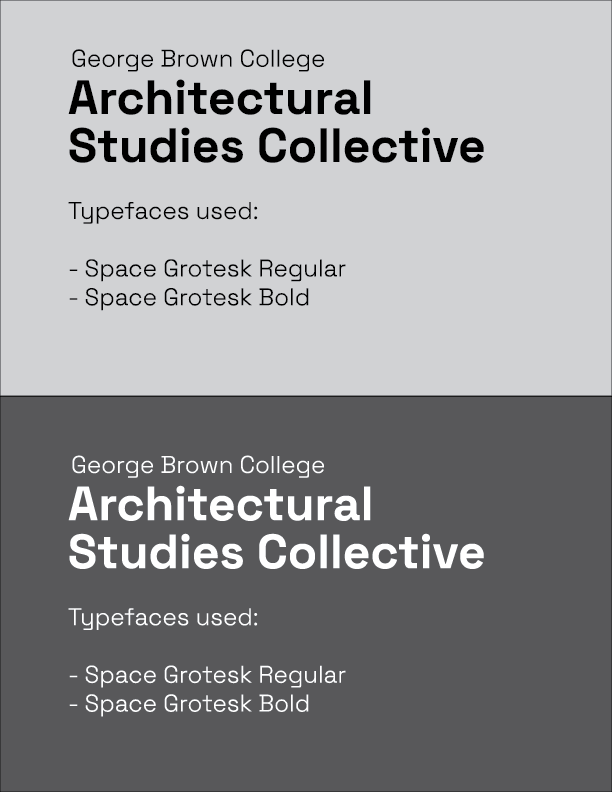
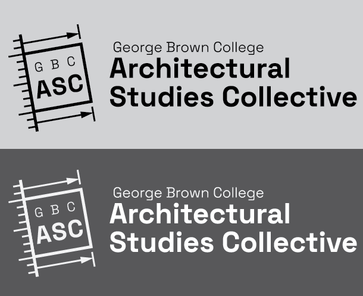

After enrolling in the Architectural Technology program at George Brown College, I had an opportunity to help start a student network. My first job: start the club webpage and design its logo:

To learn more, check out the GBC Architectural Studies Collective homepage at [gbc-asc.weebly.com](https://gbc-asc.weebly.com/)

## Process

I had been doing a lot of CAD homework and reading blueprints, so architectural graphics were fresh in my head. The first round of sketches produced these three candidates:

1. The triangle + dimensions imply a ramp or roof. I felt that tilting the logo provides an "upwards" motion to the dimension arrows. (the club acronym "ASC" could also imply "ascent")
1. The stylized "C" is decorated with centre lines, another common feature of architectural/engineering graphics
1. The third logo incorporates a scale and dimension lines, plus a square. The design is meant to evoke the view of a draftsperson measuring something on a sheet.

These sketches were then refined on Illustrator:

Then I asked my fellow club execs to vote for the logo we wanted, and logo #3 won the groupchat design competition. I then got to work with playing with the colour scheme, and finding a typeface for the club's wordmark.

And with everything in combination:

