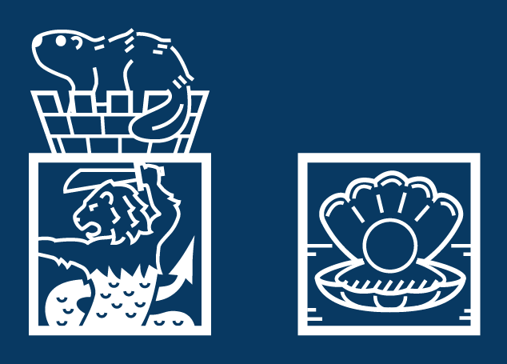
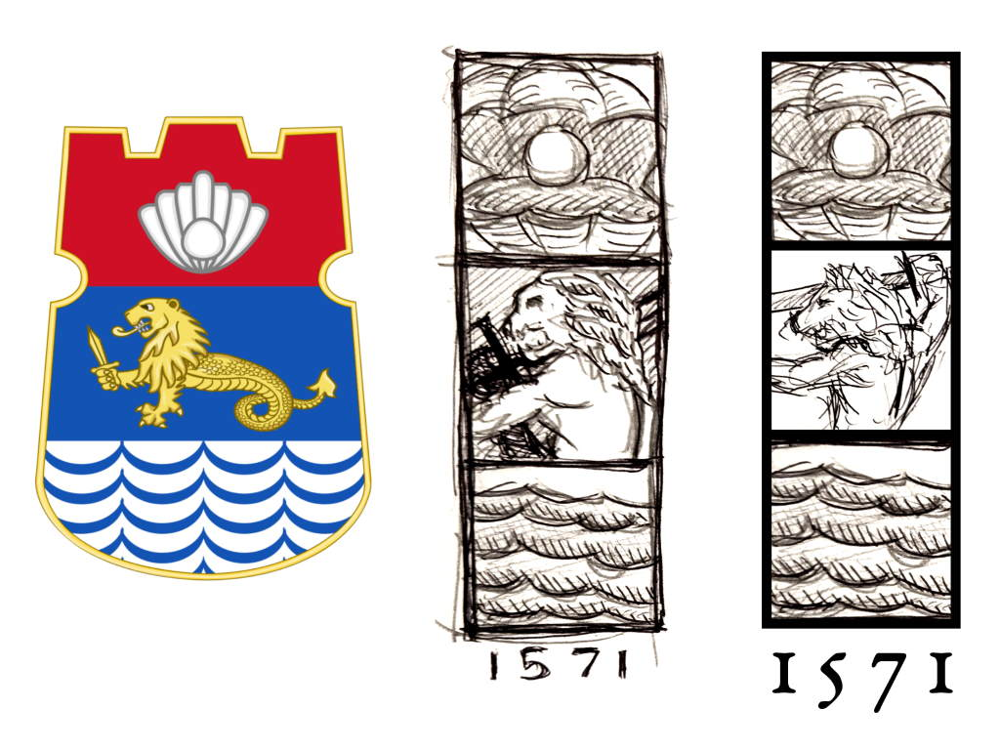
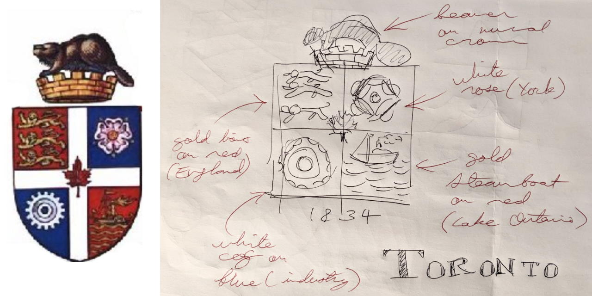
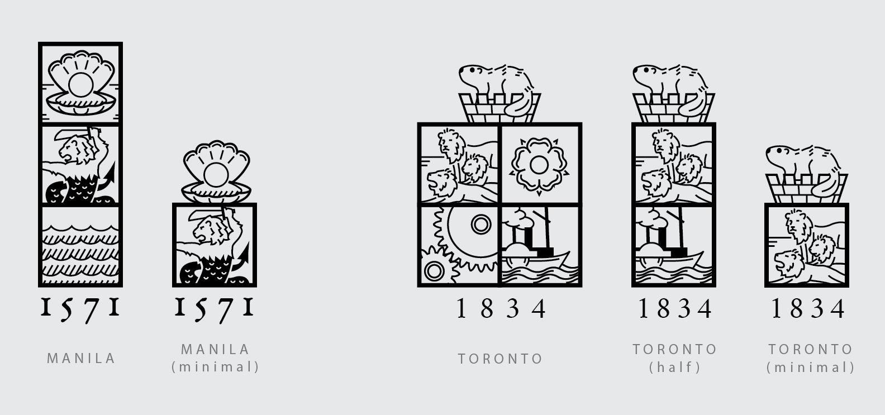

The large logo for this site depicts a Merlion in a square, plus a beaver sitting on a castle crown. And the small logo depicts a large pearl sitting in its shell:

These designs combine visual elements of my two hometowns and I kinda see them as my personal symbols.

## Process

I was talking to my siblings about tattoo ideas when I thought of redesigning something with a _Filipino_ spirit. Which led me to the coat of arms of Manila (my first hometown).

The design abstracts the three sections of the original seal into three squares, and an alternate view of the same symbols. For added action, the Merlion is "zoomed in" a little bit. In addition, the year of the modern city's founding (1571) was used as a design element. Tinkering with Manila's seal also led me to think about the seal of my current hometown (Toronto):

After some time in Illustrator, the redesigned coats of arms looked like:

