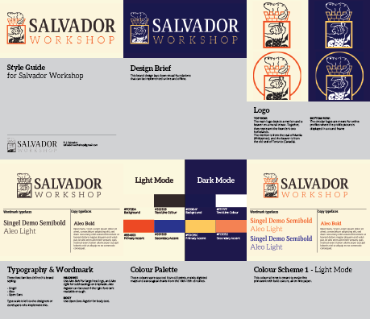

# Services

---

## Web Development

### Front-end development

If you’re looking for assistance for your front-end dev team, say less! We know how to build good code in generic web stacks to more specialized frameworks like React.

---

## Web & Graphic Design

### Brand styling (online media)

A set of graphics for an online media page. Start or refresh your online visual presence on platforms like:

- YouTube
- Facebook
- Twitch
- Bandcamp
- Soundcloud

### Online marketing campaign

A set of graphics for online advertising.

### Logo

A logo consisting of graphics and a wordmark.

### Business cards

- Standard: 3.5" x 2"
- Square: 2.5" x 2.5"

<!--

---

## Technical Graphics Support

For the professionals and power users.

### Brand asset formatting

A well-formatted package of images and media. Useful if you already have assets for your brand, but need those assets reworked into specific file formats, sizes, or for certain platforms.

### Brand style guide

Brand style guides are documents that specify and establish visual standards for your brand. A solid style guide allows your brand to have consistent visuals on advertisement, websites, social media profiles, etc.

Style guides are also handy as documentation. For example, a style spec gives future designers an easier time with updating your brand by giving them context for design decisions.

-->
